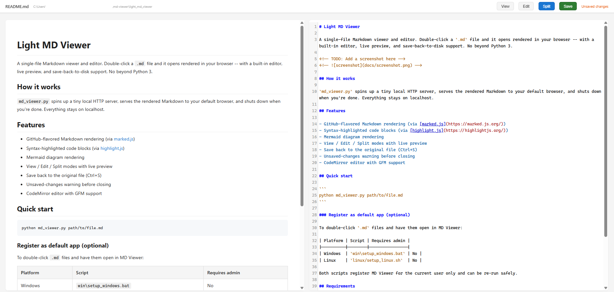

#  Light MD Viewer

A single-file Markdown viewer and editor. Opens `.md` files rendered in your browser - with a built-in editor, live preview, and save-back-to-disk support. No dependencies beyond Python 3.



## How it works

`md_viewer.py` spins up a tiny local HTTP server, serves the rendered Markdown to your default browser, and shuts down when you're done. Everything stays on localhost.

## Features

- GitHub-flavored Markdown rendering (via [marked.js](https://marked.js.org/))
- Syntax-highlighted code blocks (via [highlight.js](https://highlightjs.org/))
- Mermaid diagram rendering
- View / Edit / Split modes with live preview
- Save back to the original file (Ctrl+S)
- Unsaved-changes warning before closing
- CodeMirror editor with GFM support

## Quick start

```
python md_viewer.py path/to/file.md
```

### Register as default app (optional)

To double-click `.md` files and have them open in MD Viewer:

| Platform | Script | Requires admin |
|----------|--------|----------------|
| Windows  | `win\setup_windows.bat` | No |
| Linux    | `linux/setup_linux.sh`  | No |

Both scripts register MD Viewer for the current user only and can be re-run safely.

## Requirements

- Python 3.6+
- A web browser
- Internet connection on first load (CDN libraries are cached by the browser after that)

## License

[MIT](LICENSE)
