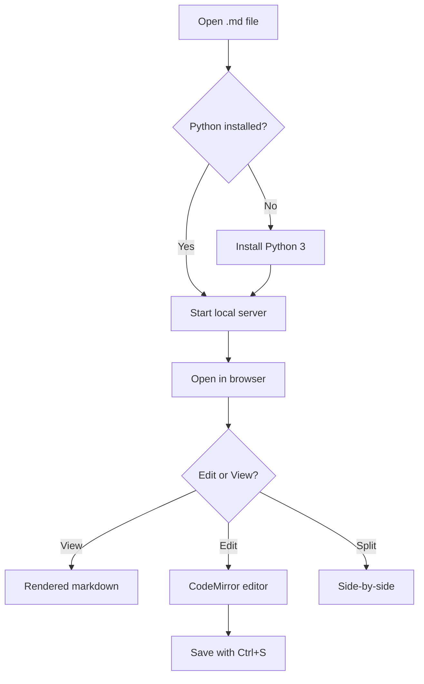
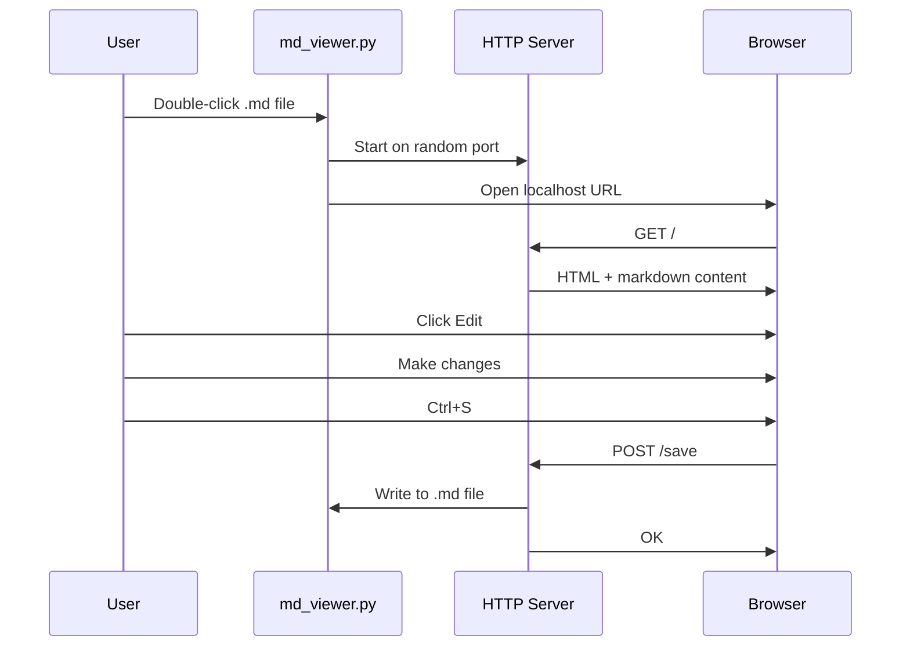
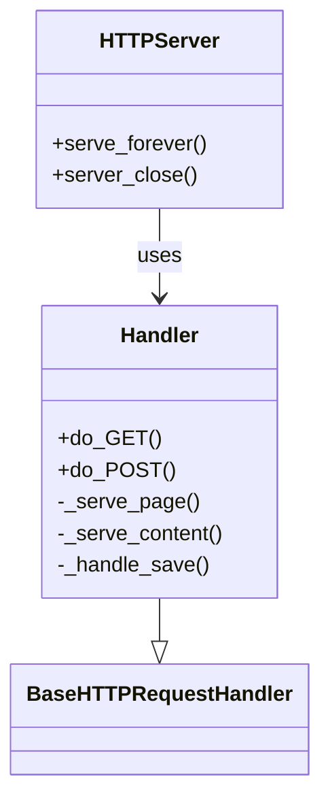
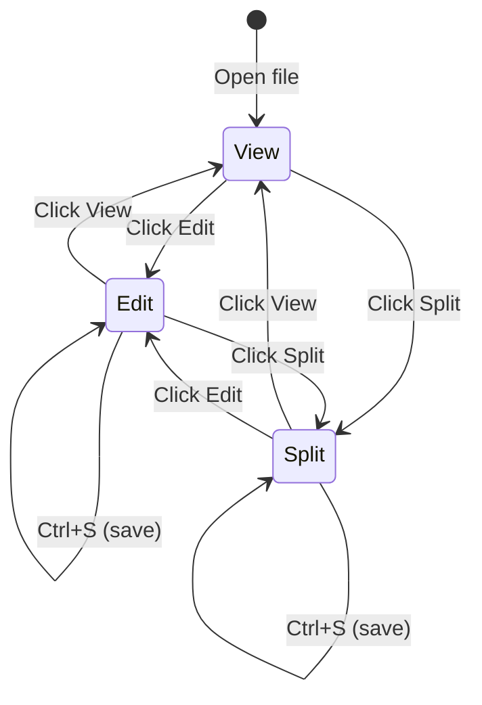

# MD Viewer

A lightweight Markdown viewer and editor that opens `.md` files in your browser. No installation, no dependencies beyond Python 3.

## Features

- **Rendered view** with GitHub-style formatting
- **Syntax-highlighted editor** (CodeMirror with GFM mode)
- **Split mode** with live preview as you type
- **Save to file** via Save button or Ctrl+S
- **Mermaid diagrams** rendered from code blocks
- **Code syntax highlighting** via highlight.js
- **Unsaved changes warning** before closing

## Setup

### Windows

1. Right-click any `.md` file
2. **Open with** > **Choose another app** > **Choose an app on your PC**
3. Browse to `MD Viewer.bat`
4. Check **"Always use this app"**

### Linux

```bash
chmod +x md-viewer.sh
```

Then set `md-viewer.sh` as the default application for `.md` files in your file manager, or via:

```bash
# Create a .desktop file
cat > ~/.local/share/applications/md-viewer.desktop << 'EOF'
[Desktop Entry]
Name=MD Viewer
Exec=/full/path/to/md-viewer.sh %f
Type=Application
MimeType=text/markdown;text/x-markdown;
EOF

# Set as default
xdg-mime default md-viewer.desktop text/markdown
xdg-mime default md-viewer.desktop text/x-markdown
```

### Manual usage

```bash
python3 md_viewer.py path/to/file.md
```

## Mermaid Diagram Examples

### Flowchart



### Sequence Diagram



### Class Diagram



### State Diagram



## Requirements

- Python 3.6+
- A web browser
- Internet connection (for CDN libraries on first load; browsers cache them after that)
